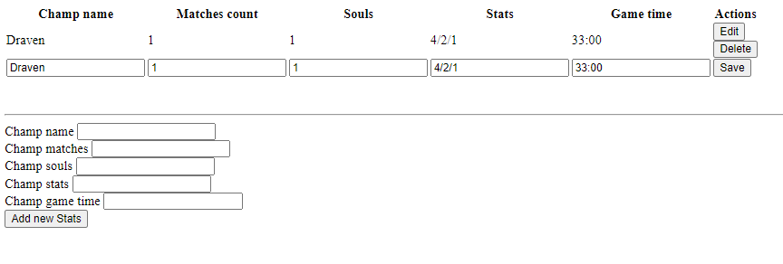

# Flask harvest challenge
Simple app written in python with flask framework, to learn python + flask and manage some League of Legends challenge result data via web page.  

## Setup
1. Download repository
2. Install required packages
```sh
pip install -r requirements.txt
```
3. Run app using
```sh
python HarvestChallenge.py
```
4. Enter website address listed in cmd in your browser. 
5. Enjoy :) 

## Screenshots


### Creating executable file
1. Install pyinstaller

```sh
pip install pyinstaller
```

2. Build command 
```sh
pyinstaller --onefile --add-data "templates;templates" --add-data "static;static" app.py
```        
3. If some errors occurs, try fix from github {2} - add those lines of code to main file, to tell flask about templates folder localization

```python
import os
import sys
from flask import Flask

if getattr(sys, 'frozen', False):
    template_folder = os.path.join(sys._MEIPASS, 'templates')
    app = Flask(__name__, template_folder=template_folder)
else:
    app = Flask(__name__)
```


### URLs
{1} https://elc.github.io/posts/executable-flask-pyinstaller/   
{2} https://github.com/ciscomonkey/flask-pyinstaller   

